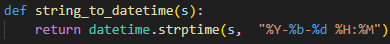
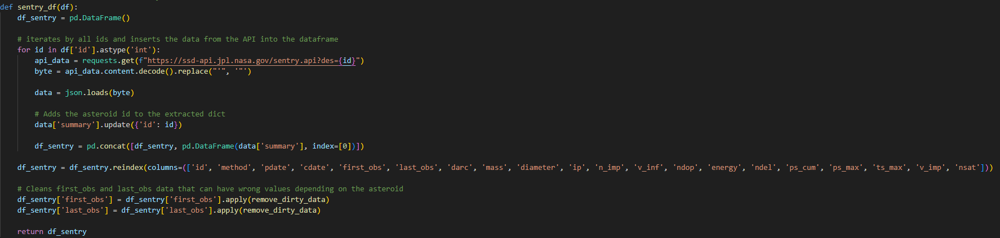

## Descrição do Projeto

Neste projeto foi desenvolvida uma pipeline ETL onde os dados vão ser extraídos das APIs NeoWS e Sentry da NASA que possuem dados de asteroides que passaram perto da Terra separando-os por dia. Após a extração é feita a limpeza e transformação dos dados usado a biblioteca de Python, Pandas. Finalmente, a carga dos dados é feita para um DataWarehouse rodando numa instância do SGBD Microsoft SQL Server onde os dados vão estar prontos para serem usados em análises.

Além disso, para organizar o fluxo de execução da pipeline de dados foi usada a ferramenta Airflow para que todos os dias a pipeline seja executada, permitindo assim, que os dados sejam atualizados diariamente.

## Objetivos do Projeto
O principal objetivo deste projeto é demonstrar minha capacidade de: criar fluxos de orquestração de dados com o Airflow, desenvolvimento de pipelines de dados em python, extração de dados através de APIs e arquitetura de dados.

Além disso, outro objetivo importante deste projeto é responder às seguintes perguntas com análise de dados:
- Qual foi o dia com a maior quantidade de asteroides passando perto da Terra?
- Qual foi o asteroide que passou mais próximo da Terra?
- Qual foi o asteroide que passou próximo da Terra com a maior velocidade relativa?
- Qual é o asteroide com o maior tamanho estimado?
- Qual é o asteroide que liberaria a maior quantidade de energia em megatons de TNT caso acertasse a Terra?

## Tecnologias

As tecnologias utilizadas neste projeto foram:

 - [Docker](https://www.docker.com/)
 - [Python](https://www.python.org/)
 - [Pandas](https://pandas.pydata.org/)
 - [NASA NeoWS API](https://api.nasa.gov/)
 - [Sentry API](https://ssd-api.jpl.nasa.gov/doc/sentry.html)
 - [Microsoft SQL Server](https://www.microsoft.com/pt-br/sql-server/sql-server-downloads)
 - [Airflow](https://airflow.apache.org/)

## API
A API usada como fonte de dados desse projeto foi a NASA NeoWS API, com ela é possível extrair dados de asteroides que passaram próximo da Terra em determinado dia. Os dados extraídos podem possuir campos diferentes em dias diferentes, por isso, durante o desenvolvimento do projeto foi de extrema importância aumentar a resiliência da pipeline colocando diversas validações no código para que ela fosse capaz de identificar e lidar com campos diferentes, como por exemplo: dias em que a API não retorna nada por não ter passado nenhum asteroide próximo da Terra e quando asteroides específicos possuem monitoração a mais que os outros, como é o caso com asteroides "Sentry" que são asteroides com possibilidade de colisão com o nosso planeta.

## DAG
A DAG do airflow foi configurada para ser executada uma vez ao dia, sempre às 21 horas, a pipeline é executada por um PythonOperator. Também foi configurado para que o Airflow faça execução retroativa, do início de 2023 até o dia atual, para que possamos ter uma massa de dados maior para análise.

<p align="center">
  
</p>

A função exec que vai ser executada pela DAG vai criar uma engine de conexão com o banco de dados usando a biblioteca SQLAlchemy, determinar qual a data de execução através do parâmetro "logical_date" do Airflow, com esse parâmetro é possível executar automáticamente a pipeline para os dias retroativos. São chamadas também as funções de extração, transformação e carga de dados que, em conjunto, formam a pipeline de dados.

<p align="center">
  
</p>

## Extração de Dados
A extração de dados inicial é feita através da função api_data_extract, onde os dados de determinado dia vão ser extraídos da API através de um GET. Com a extração feita o JSON é normalizado e os dados são retornados no formado de DataFrame do pandas.

<p align="center">
  
</p>

## Transformação de Dados
O primeiro passo da transformação de dados é renomear as colunas pois como foi feito normalização do JSON muitas colunas ficaram com nomes muito grandes, por isso vamos mudar para nomes menos complexos que serão usados durante as outras fases do projeto. Este processo é feito pela função df_rename_columns, o DataFrame é passado como parâmetro e é retornado o mesmo DataFrame porém com os nomes das colunas alterados.

<p align="center">
  
</p>

Com as colunas renomeadas vamos começar com a limpeza e transformação dos dados. As transformações vão ser feitas na função clean_transform_data_main_df, o código completo pode ser visto na imagem abaixo:

<p align="center">
  
</p>


Primeiro transformamos o string com a data e hora da aproximação do asteroide em um campo Datetime, para isso é usada a função apply para aplicar uma função de transformação para todos os valores de uma coluna específica, a função que vamos aplicar é a string_to_datetime que vai usar a função strpdatetime para transformar todos os valores string em valores datetime.

<p align="center">
  
</p>

A próxima transformação aplicada é no campo "name", nele removemos os parêntesis presentes no nome dos atreróides também usando a função apply para aplicar a função remove_parentheses.

<p align="center">
  
</p>

Para os dataframes de tamanho, distância de erro e velocidade dos asteroides não fazemos nenhuma transformação dos dados, apenas movemos os dados do dataframe principal para os novos dataframes que vão ser criados.

<p align="center">
  
</p>

Por fim, criamos o dataframe de sentry, nesse dataframe usamos outra API, a Sentry API que também é da NASA. Os dados que são extraídos dessa API são dos asteroides cuja flag "is_sentry_object" no dataframe principal é verdadeira, com isso conseguimos dados como o método usado para descobrir o asteroide, diâmetro, massa, quando ele foi analisado pela primeira e última vez, etc. É feita a extração individual para cada asteroide com a flag mencionada anteriormente e então é feita a concatenação dos dataframes para no caso de que tenha mais de um objeto no mesmo dia, é então adicionado o id ao dataset extraído para facilitar o relacionamento na fase de análise e dados de data em formato incorreto são corrigidos usando a função "remove_dirty_data" que vai ser aplicada para cada valor dos campos "first_obs" e "last_obs" do dataframe.

<p align="center">
  
</p>

## Carga de Dados
Para fazer a carga de dados é usada a função load_to_database que vai fazer a inserção dos registros que foram extraídos no banco de dados usando a função to_sql do pandas. 

<p align="center">
  
</p>

## Views de Banco de Dados
Com os dados carregados no banco de dados foram criadas views, elas são:

<p align="center">
  
</p>

A view space_object_links vai trazer para o analista links relacionados à chamada da API de determinado asteroide e o link para página do asteroide no site da NASA. A "estimated_size_range" serve para facilitar a análise, com ela é possível analisar o intervalo de tamanho possível para determinado asteroide. 

## Como Usar

Para executar este projeto um dos pré-requisitos será ter Docker instalado no seu computador, você pode encontrar um tutorial de como instalar o Docker para o seu sistema operacional [aqui](https://docs.docker.com/engine/install/). Também é necessário ter uma chave da NASA Open APIs, você pode conseguir uma [aqui](https://api.nasa.gov/).

Com o Docker instalado e uma chave da API em mãos abra a linha de comando do seu sistema operacional e execute os seguintes passos:

- Clone o repositório para o seu diretório local
```bash
git clone https://github.com/pedrohcg/Using-Airflow-to-Create-Data-Flow-For-Nasa-NeoWS-API.git
```

- Crie um arquivo ".env" na pasta "dags" e o preencha com o seguinte:
```bash
API_KEY=sua_key_aqui
```

- Primeiro criamos o container do Airflow, para isso precisamos entrar na pasta do projeto na linha de comando e executar
```bash
docker compose up airflow-init
```

- E depois:
```bash
docker compose up
```

- Na linha de comando abra a pasta "database". Use o seguinte comando para criar a imagem da instância do banco de dados, a imagem já vai ter as tabelas e views usadas nesse projeto.
```bash
docker build -t mssql-database .
```

- E com o comando abaixo criamos a o container.
```bash
docker run -p 1433:1433 --name mssql2 --network projeto-nasa_default -d mssql-database
```

- Agora devemos alterar o ip de conexão do airflow ao banco de dados, para isso vamos dar inspect na network do docker e substituir o ip no código da função database_connection do arquivo "pipeline.py"

```bash
docker network inspect projeto-nasa_default
```

<p align="center">
  
</p>

<p align="center">
  
</p>


- Pronto! Com isso temos o container do banco de dados e aplicação rodando, agora só precisamos nos conectar na página web do Airflow que fica no seguinte link
```bash
http://localhost:8080/home
```

- Vai aparecer uma tela de login, por padrão o login e senha do administrador são "airflow". Fazendo o login vai aparecer uma tela parecida com a da print abaixo:

<p align="center">
  
</p>

- Habilitando a DAG vai fazer com que o Airflow comece a executar do dia 01/01/2023 até hoje.

## Respostas Para as Questões Propostas

### Qual foi o dia com a maior quantidade de asteroides passando perto da Terra?
Para descobrirmos o dia que mais asteroides passaram próximos da Terra fazemos uma query simples onde usamos a função "count" e agrupamos pela data após converter a coluna datetime "close_approach_date" para data, a query usada foi a seguinte

<p align="center">
  
</p>

Como resultado podemos ver que, para os dados que temos no banco atualmente, o dia que tivemos a maior quantidade de asteroides passando próximo da Terra foi 6 de abril de 2023.

<p align="center">
  
</p>

### Qual foi o asteroide que passou mais próximo da Terra?
Para descobrirmos qual foi o asteroide que passou mais próximo da Terra vamos usar a coluna "miss_distance_kilometers" da tabela miss_distance e ordenamos o resultado, queremos encontrar qual asteroide registrado vai possuir a menor distância. Podemos fazer isso com a seguinte query:

<p align="center">
  
</p>

Com isso, é possível perceber que o asteroide que passou mais próximo foi o 1998 HH49 no dia 17/10/2023 a uma distância de aproximadamente 1173362 km ou 3 vezes a distância entre a Lua e a Terra.

<p align="center">
  
</p>

### Qual foi o asteroide que passou próximo da Terra com a maior velocidade relativa?
Para descobrir o asteroide que passou com a maior velocidade vamos fazer uma query que vai usar as tabelas "space_objects" e "relative_velocity" e ordenamos o resultado pelo campo "relative_velocity_km_per_hour". A query é a seguinte:

<p align="center">
  
</p>

Com o resultado é possível perceber que o asteroide com a maior velocidade é o 523630 2009 OG com uma velocidade relativa de aproximadamente 157512 km/h ou 44 km/s

<p align="center">
  
</p>

### Qual é o asteroide com o maior tamanho estimado?
Para descobrir qual é o asteroide com o maior tamanho precisamos usar as tabelas "space_objects", "estimated_size" e a view "estimated_diameter_range". A query abaixo vai retornar o nome do asteroide, seu intervalo de tamanho e ordernar o resultado pelo campo "estimated_diameter_max_km"

<p align="center">
  
</p>

Como podemos ver, estimamos que o maior asteroide que passou próximo da Terra nesse período foi o 2212 Hephaistos 1978 SB com um diâmetro estimado entre 5.28 e 11.8 km

<p align="center">
  
</p>

### Qual é o asteroide que liberaria a maior quantidade de energia em megatons de TNT caso acertasse a Terra?
Para determinar a quantidade de energia liberada pelo impacto de um asteroide vamos usar o campo "energy" da tabela "sentry_object". Selecionamos os dados de nome, se é ou não considerado perigoso pela NASA, a energia liberada e a equivalência energética quando comparamos com a energia liberada por uma Tsar Bomb, que é a bomba atômica mais poderosa já detonada pela humanidade.

<p align="center">
  
</p>

Como podemos ver, o asteroide 29075 1950 DA é considerado como perigoso pela nasa e um impacto com a Terra liberaria uma energia de 75190 megatons de TNT ou equivalente a detonação de aproximadamente 1319 Tsar Bombs, seguido pelo 101955 Bennu 1999 RQ36 que liberaria uma energia equivalente a 1421 megatons de TNT ou 25 Tsar Bombas. Em ambos os casos as consequências seriam desastrosas para a humanidade.

<p align="center">
  
</p>

## Conclusão
Este projeto demonstra minhas habilidades e conhecimentos sobre o uso de diversas ferramentas fundamentais para o dia a dia de um engenheiro de dados como: Apache Airflow, Python, Pandas, SQL, SGBD (Microsoft SQL Server), extração de dados por API, lidar com a possibilidade de receber dados em formatos diferentes e tratá-los entre outras. 

Diversos desafios foram enfrentados durante o desenvolvimento, o maior deles o de conseguir preparar a pipeline para suportar formatos de dados diferentes como, por exemplo, em um dia que não teve nenhum asteroide passando por perto da Terra é necessário validar se o json recebido da API não é vazio, ou quando em determinado dia um objeto considerado como "sentry" retorna informações a mais do que os que os outros.

Ele também demonstra que eu sou capaz de desenvolver pipelines de dados, implementando técnicas de extração, limpeza, enriquecimento e transformação de dados. Além disso, também demonstra que sou capaz de fazer análise de dados básica com SQL.